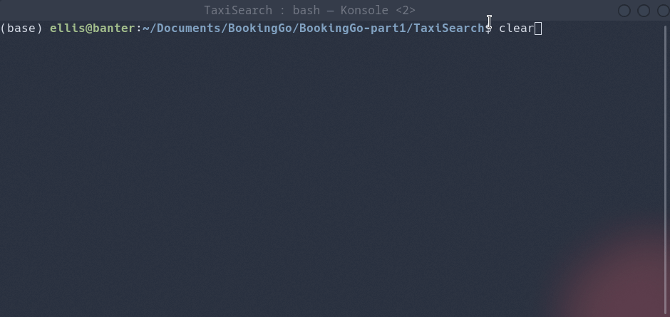

# Part 1

## Introduction
The console application for part one is developed using the Python CLI framework [Typer](https://typer.tiangolo.com/). Typer provides a quick way of building console applications with Python, eliminating alot of the boilerplate code needed to handle command line arguments. Following on from this if incorrect arguments are passed to the program suitable error messages are provided by default.

## Requirements

- Python - 3.6.*
- requests - 2.22.0 
- typer
- colorama
- click_spinner

The project dependencies can be found in the requirements.txt file and can be installed with pip using the following commands:

```
cd BookingGo-part1
pip install -r requirements.txt
```

Note: this requires python version >= 3.6

## Getting started
In order to search the BookingGo API the TaxiSearch CLI exposes a search command which takes 5 parameters, the parameters are *pickup_lat* *pickup_lng* *dropoff_lat* *dropoff_lng* *max_passengers*. In addition to this the empty flag (--) must be passed as an additional parameter to tell typer that arguments in the form `-x` should be treated as negative numbers and not flags. An example search command along with the output produced can be seen below. In addition to the base 5 paramaters the `--json` flag can be passed which converts the output into a json format, this will be interfaced with the REST API in part 2.

```
cd TaxiSearch
python TaxiSearch.py search -- 51.470020 -0.454295 51.507351 -0.127758 5
```



## Testing
The tests can be ran using the following command:

```
cd TaxiSearch
python TaxiSearchTest.py
```


# Part 2